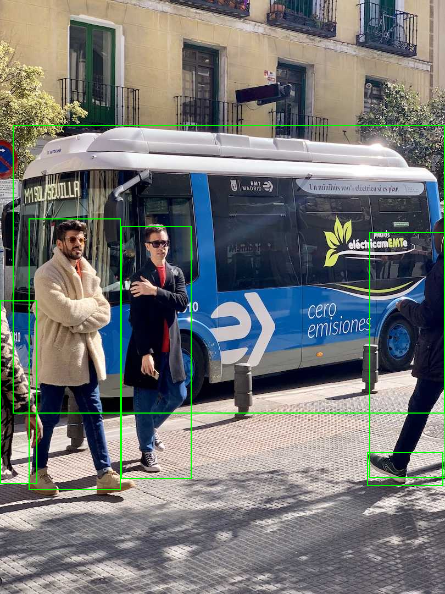
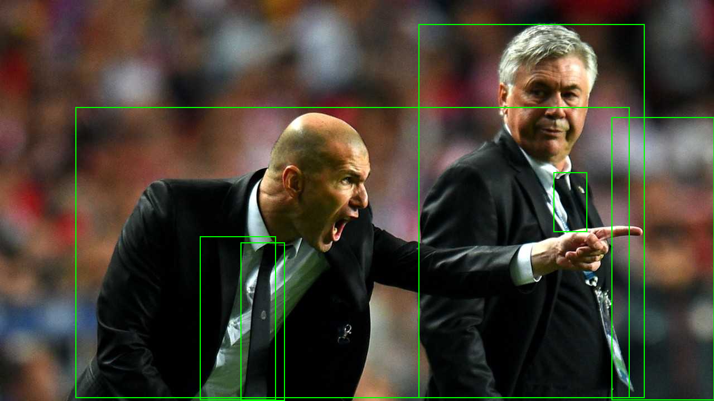

# yolox_cpp

Training **YOLOX** (Megvii) in C++ with the same from-scratch, dependency-free autograd
engine used in [yolov8_cpp](https://github.com/yomei-o/yolov8_cpp) /
[yolov5_cpp](https://github.com/yomei-o/yolov5_cpp) /
[yolov11_cpp](https://github.com/yomei-o/yolov11_cpp). CPU/OpenMP with `g++`, real CUDA
with `nvcc -DUSE_CUDA` (single-header `pure/backend.hpp` seam).

YOLOX is the most different of the family: **anchor-free with a decoupled head** and
**SimOTA** dynamic label assignment (no anchors, no DFL/TAL). See
[`pure/NOTES_yolox.md`](pure/NOTES_yolox.md) for the full architecture blueprint.

## Status
- ✅ M0: oracle (`torch.hub` yolox-tiny) + architecture blueprint + **Focus op** (space-to-depth), gradient-checked.
- ✅ M1: full forward parity vs PyTorch (`net_yolox.hpp` + `export_yolox.py`) — L0 1.8e-4 / L1 4e-5 / L2 1.9e-5.
- ✅ M2: loss — **SimOTA** (plain, no-grad) == YOLOX `get_assignments`; IoU/BCE forward 1.9e-6, **grads 3e-8** vs PyTorch.
- ✅ M3: **end-to-end training** (`m3_train.cpp`, forward→SimOTA→loss→backward→SGD) — loss 24.1→3.2.

- ✅ **.pt write-back**: train unfused conv+BN in C++ → drop into a standard YOLOX `.pt`
  (re-loads with 0 missing/unexpected keys, runs). `net_yolox_unfused.hpp` + `ref/writeback_yolox.py`.
- ✅ **ONNX export/import**: `onnx_export_yolox.cpp` writes `yolox_tiny.onnx` (Focus = strided
  Slice + Concat) — onnxruntime-verified (~9e-5); `m_onnx_run.cpp` runs a `.onnx` graph-driven
  in the pure engine (~1.8e-4). Hand-rolled protobuf, no deps.

- ✅ **inference**: anchor-free decode + class-aware NMS (`pure/infer_yolox.hpp`);
  `pure/m_demo.cpp` runs on a real image straight from a checkout (shipped
  `weights/yolox_tiny/`) — `bus.jpg` → bus + 3-4 people. `pure/m_synth.cpp` is an
  end-to-end test (train a few dozen 128×128 synthetic images → detect).
- ✅ **all sizes** t/n/s/m/l/x (nano = depthwise) across forward / training / .pt / ONNX.

conv routes through the single-header `bk::` device seam, so `nvcc -DUSE_CUDA` trains and
runs on a real GPU. **Colab GPU check: [colab/gpu_check.ipynb](colab/gpu_check.ipynb)**
(https://colab.research.google.com/github/yomei-o/yolox_cpp/blob/main/colab/gpu_check.ipynb).

## Run the demo
```sh
g++ -std=c++20 -O2 -fopenmp -Ipure/third_party pure/m_demo.cpp -o m_demo   # or nvcc -DUSE_CUDA
./m_demo assets/bus.jpg out.png 640
```

| `assets/bus.jpg` → | `assets/zidane.jpg` → |
|---|---|
|  |  |

```
assets/bus.jpg  810x1080          assets/zidane.jpg  1280x720
  bus     conf=0.94                 person  conf=0.87
  person  conf=0.87                 person  conf=0.84
  person  conf=0.86                 tie     conf=0.75
  person  conf=0.83                 tie     conf=0.48
```
(YOLOX-tiny, shipped `weights/yolox_tiny/`; decode + NMS in `pure/infer_yolox.hpp`.)

## Train with zero Python — the full loop in C++

`pure/train_cli.cpp` is a real training environment, pure C++, **no Python at run time**:
dataset scan → shuffled mini-batches (hflip + brightness augmentation) over epochs →
per-image **SimOTA** → YOLOX loss → Adam (warmup + cosine LR + weight decay) →
**per-epoch validation mAP@0.5** → save `best.pt` / `last.pt` via the pure-C++ `.pt` writer.

```sh
cl /std:c++20 /O2 /EHsc /Ipure\third_party pure\make_init_pt.cpp   # or g++ ...
cl /std:c++20 /O2 /EHsc /Ipure\third_party pure\train_cli.cpp

./make_init_pt init.pt from yolox_tiny.pth     # C++ builds the initial-weights .pt (see below)
./train_cli pure/ref/data_synth/list.txt pure/ref/data_synth/val.txt 16 4 init.pt
#   epoch  1/16  loss 7.14  val mAP@0.5 0.000
#   epoch 13/16  loss 1.53  val mAP@0.5 1.000   -> best.pt / last.pt (pure C++)
```

The C++-trained `best.pt` loads straight back into the YOLOX reference model
(`model.load_state_dict(torch.load('best.pt'))`, 0 unexpected keys) and detects the right
classes. Checkpoint keys are paired by **name** via `names.txt` (the engine's CSP emit
order differs from the module `state_dict` order).

### Make the initial-weights `.pt` in C++ — no Python, no YOLOX repo

`pure/make_init_pt.cpp` writes a valid `state_dict` `.pt` entirely in C++, driven only by
two tiny text files that ship in the repo — `pure/ref/data_unf/manifest_unfused.txt`
(per-layer shapes) and `names.txt` (state_dict keys). No Python, no libtorch, **and none of
the Megvii YOLOX package / `loguru` / `tabulate` / `thop`** that the Python export path pulls in:

- **`rand`** — He/Kaiming random init, fully self-contained (no pretrained file, no Python).
  Loads into YOLOX-tiny (0 unexpected). Trains mechanically, but from-scratch convergence
  needs real data volume + many epochs.
- **`from <yolox_tiny.pth>`** — copies pretrained values read in C++ by `ptio`. It handles a
  plain state_dict, a raw `{'model': nn.Module}` checkpoint, **and the Megvii layout
  `{'model': OrderedDict[str→Tensor], ...}`** (`load_pt_state_under`). The only input is the
  `.pth` file itself (just download it). Verified to reproduce the fine-tune run exactly
  (val mAP@0.5 → 1.000 by epoch 13).

`train_cli` starts from that init `.pt` (`load_unfused_pt` in `pure/net_yolox_unfused.hpp`,
arch from the manifest, tensors looked up by `names.txt` key) when it's given and present,
else from the `.bin` export. So a fresh clone bootstraps and trains with **zero Python**:
`make_init_pt` → `init.pt` → `train_cli`. (`python pure/ref/make_synth.py 96 24` is the one
Python touch, only to fabricate the demo images.)

## Build (engine self-test, no deps)
```sh
g++ -std=c++20 -O2 -fopenmp pure/gradcheck2.cpp -o gc2 && ./gc2   # incl. Focus
```
